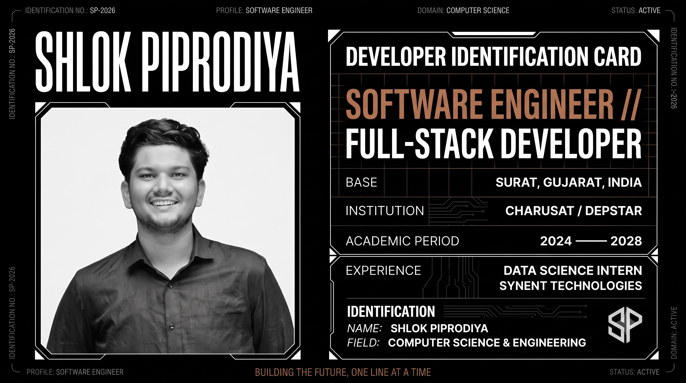

<div align="center">



<br><br>

# SHLOK PIPRODIYA

### `SOFTWARE ENGINEER // FULL-STACK DEVELOPER`

<p align="center">
Building software across full-stack architectures, backend systems, and data-driven intelligence.
</p>

<p align="center">
  <a href="https://github.com/shlok1286"></a>
  <a href="https://github.com/shlok1286"></a>
  <a href="https://github.com/shlok1286"></a>
  <a href="https://github.com/shlok1286"></a>
</p>

<p align="center">
  <a href="https://github.com/shlok1286"></a>
  <a href="https://linkedin.com/in/shlok-piprodiya-3075a91ba"></a>
  <a href="https://shlokpiprodiya.vercel.app/"></a>
  <a href="https://www.npmjs.com/package/auth12"></a>
</p>

</div>

---

```text
IDENTIFICATION :: SHLOK PIPRODIYA
ROLE           :: SOFTWARE ENGINEER // FULL-STACK DEVELOPER
DOMAIN         :: COMPUTER SCIENCE & ENGINEERING
COORDINATES    :: SURAT, GUJARAT, INDIA [21.1702° N, 72.8311° E]
CURRENT FOCUS  :: SCALABLE WEB SYSTEMS · ARCHITECTURE · MACHINE LEARNING
```

---

## `01` // TECHNICAL PROFILE

> **SYSTEM CAPABILITIES & CORE STACK** &nbsp;`[SPEC-2026]`

<table>
<tr>
<th width="50%" align="left"><code>01.1</code> &nbsp; CLIENT-SIDE ARCHITECTURE</th>
<th width="50%" align="left"><code>01.2</code> &nbsp; SERVER & RUNTIME SYSTEMS</th>
</tr>
<tr>
<td valign="top">

### FRONTEND
<sub>Responsive user interfaces, component systems & web standards</sub>

<br>

<a href="https://react.dev"></a>
<a href="https://nextjs.org"></a>
<a href="https://www.typescriptlang.org"></a>
<a href="https://developer.mozilla.org/en-US/docs/Web/JavaScript"></a>
<a href="https://vitejs.dev"></a>
<a href="https://tailwindcss.com"></a>

<br><br>

- **Core Frameworks:** React · Next.js · Vite
- **Languages:** TypeScript · JavaScript (ES6+)
- **Interface Styling:** Tailwind CSS · Modern Layouts

</td>
<td valign="top">

### BACKEND
<sub>Microservices, RESTful interfaces & server architectures</sub>

<br>

<a href="https://nodejs.org"></a>
<a href="https://expressjs.com"></a>
<a href="https://flask.palletsprojects.com"></a>
<a href="https://restfulapi.net"></a>

<br><br>

- **Runtimes & Frameworks:** Node.js · Express · Flask
- **Communication:** RESTful APIs · Endpoint Architecture
- **Infrastructure:** Server Logic · Middleware · Authentication

</td>
</tr>
<tr>
<th width="50%" align="left"><code>01.3</code> &nbsp; INTELLIGENCE & DATA PIPELINES</th>
<th width="50%" align="left"><code>01.4</code> &nbsp; DATA PERSISTENCE & SCHEMAS</th>
</tr>
<tr>
<td valign="top">

### DATA SCIENCE & MACHINE LEARNING
<sub>Analytical computing, pattern modeling & intelligent workflows</sub>

<br>

<a href="https://www.python.org"></a>
<a href="https://pandas.pydata.org"></a>
<a href="https://numpy.org"></a>
<a href="https://scikit-learn.org"></a>
<a href="https://streamlit.io"></a>

<br><br>

- **Core Language:** Python 3
- **Data Engineering:** Pandas · NumPy
- **Machine Learning:** Scikit-learn
- **Dashboard Prototyping:** Streamlit

</td>
<td valign="top">

### DATABASES & STORAGE
<sub>Structured records, document storage & object-relational mapping</sub>

<br>

<a href="https://www.postgresql.org"></a>
<a href="https://www.mongodb.com"></a>
<a href="https://supabase.com"></a>
<a href="https://www.prisma.io"></a>

<br><br>

- **Relational Databases:** PostgreSQL · Supabase
- **Document Store:** MongoDB
- **ORM & Data Layer:** Prisma ORM

</td>
</tr>
<tr>
<th colspan="2" align="left"><code>01.5</code> &nbsp; ECOSYSTEM, INFRASTRUCTURE & PLATFORMS</th>
</tr>
<tr>
<td colspan="2" valign="top">

<a href="https://git-scm.com"></a>
&nbsp;
<a href="https://github.com"></a>
&nbsp;
<a href="https://www.docker.com"></a>
&nbsp;
<a href="https://razorpay.com"></a>

<br><br>

- **Version Control:** Git · GitHub Enterprise / Open Source
- **Containerization:** Docker
- **Financial Infrastructure:** Razorpay Payment Gateway Integration

</td>
</tr>
</table>

---

## `02` // EDUCATION

> **ACADEMIC RECORD & INSTITUTIONAL AFFILIATION** &nbsp;`[REC-2024]`

<table>
<tr>
<td width="62%" valign="top">

<sub>DEGREE PROGRAM</sub>
### B.TECH IN COMPUTER SCIENCE & ENGINEERING
**Undergraduate Program in Engineering**

<br>

<sub>INSTITUTION</sub><br>
**CHARUSAT / DEPSTAR**  
*Devang Patel Institute of Advance Technology and Research*  
*Charotar University of Science and Technology*

</td>
<td width="38%" valign="top">

<sub>ACADEMIC PERIOD</sub><br>
`2024 — 2028` &nbsp; 

<br><br>

<sub>LOCATION BASE</sub><br>
**Surat, Gujarat, India**

<br><br>

<sub>DISCIPLINE</sub><br>
**Computer Science & Engineering**

</td>
</tr>
</table>

---

## `03` // CONNECT

> **COMMUNICATION CHANNELS & DIRECT REPOSITORIES**

<div align="center">

<br>

<a href="https://github.com/shlok1286"></a>
&nbsp;
<a href="https://linkedin.com/in/shlok-piprodiya-3075a91ba"></a>
&nbsp;
<a href="https://shlokiee.vercel.app/"></a>
&nbsp;
<a href="https://www.npmjs.com/package/auth12"></a>

<br><br>

</div>

---

<div align="center">

```text
BUILD  →  LEARN  →  SHIP  →  REPEAT
```

<sub>SHLOK PIPRODIYA &nbsp;•&nbsp; SOFTWARE ENGINEER // FULL-STACK DEVELOPER &nbsp;•&nbsp; SURAT, INDIA</sub>

</div>
